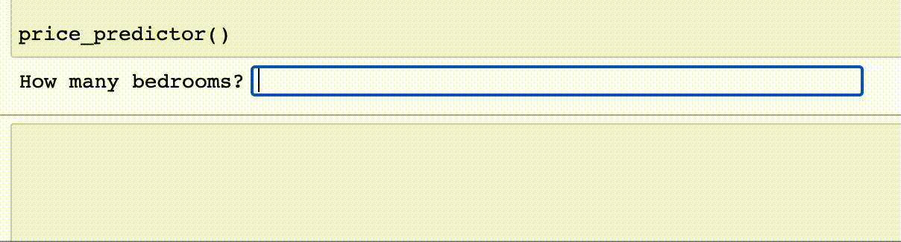
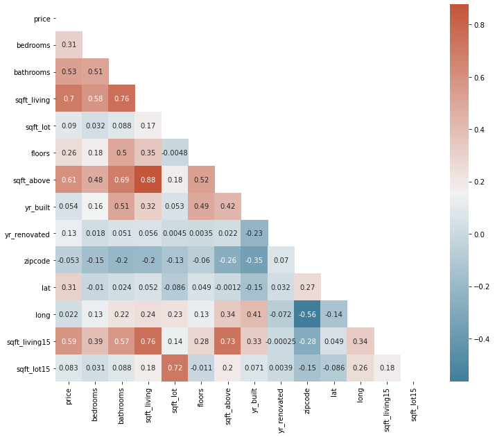
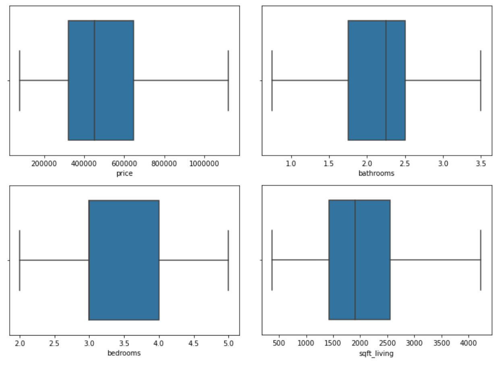
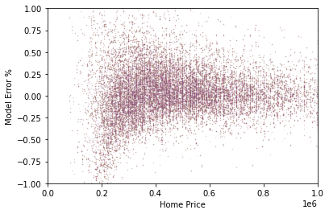
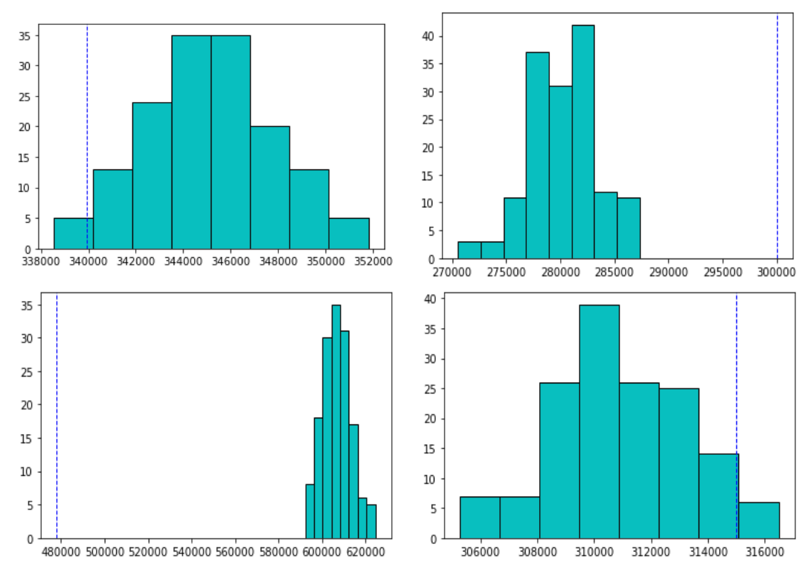

 <h1>  Group Uranus - Phase 2 Project </h1> 

  

 <h2> Contributors:  Brad Blackwood, Ashley Eakland and Jalen Charles </h2> 

### Project Proposal: A user-friendly tool to predict pricing of homes using just a few key metrics, accomplished using multiple linear regression analysis. User interface and functionality of proposed tool shown below.

### Business Understanding
##### Utilizing the CRISP-DM process, it is our goal with this project to present to both home buyers and sellers a user friendly tool to accurately predict the price of a home based on a few key metrics. The first step in this process is understanding the business, which in this case would be the consumer benefit of having a user friendly tool for home price predictions. Having an easily accessible and user friendly tool would enable the every day consumer to roughly estimate the price of a home without the need for extensive research or external support.

### Data Understanding and Preparation
##### For this analysis, and the second and third steps of the CRISP-DM process, we will gain a better understanding of our dataset. Being that this is a dataset of home sales data, it will be incredibly useful in the development of a home sales price prediction tool. Utilizing the column names and descriptions below, as well as the following code blocks, we discovered the following:

* This is a dataset of home sales in King County, Washington containing over unique 21,500 home sale data points.
* Data includes:
    * `id` - Unique ID number for a home
    * `date` - Date home was sold - this dataset contains sales from May 2014 through May 2015
    * `price` - Sale price - which is our prediction target for this project
    * `bedrooms` - Number of bedrooms in the home
    * `bathrooms` - Number of bathrooms in the home
    * `sqft_living` - Square footage of living space in the home
    * `sqft_lot` - Square footage of the lot 
    * `floors` - Number of floors (levels) in the home
    * `waterfront` - Whether the home is on a waterfront, represented as `YES` or `NO` (includes Duwamish, Elliott Bay, Puget Sound, Lake Union, Ship Canal, Lake Washington, Lake Sammamish, other lake, and river/slough waterfronts)
    * `view` - Quality of view from the home ranked from `NONE` to `EXCELLENT` (includes views of Mt. Rainier, Olympics, Cascades, Territorial, Seattle Skyline, Puget Sound, Lake Washington, Lake Sammamish, small lake / river / creek, and other)
    * `condition` - How good the overall condition of the house is. Related to maintenance of house and ranked 1 through 5 with 1 being `Poor` and 5 being `Very Good` (see the [King County Assessor Website](https://info.kingcounty.gov/assessor/esales/Glossary.aspx?type=r) breakdown of each condition rating specifics.)
    * `grade` - Overall grade of the house. Related to the construction and design of the house and rated 1 through 13 with 1 being short of minimum building standards and 13 being custom designed and built or "mansion" quality (see the [King County Assessor Website](https://info.kingcounty.gov/assessor/esales/Glossary.aspx?type=r) for breakdown of what each grade covers specifically)
    * `sqft_above` - Square footage of house above ground level/separate from the basement
    * `sqft_basement` - Square footage of the basement
    * `yr_built` - Year when house was built
    * `yr_renovated` - Year when house was renovated, if applicable
    * `zipcode` - ZIP Code used by the United States Postal Service
    * `lat` - Latitude coordinate
    * `long` - Longitude coordinate
    * `sqft_living15` - The square footage of interior housing living space for the nearest 15 neighbors
    * `sqft_lot15` - The square footage of the land lots of the nearest 15 neighbors
    
* Preliminary analysis shows strongest correlation with prediction target feature (`price`) in the `sqft_living` column. This will be our focus feature.

  

* Null values are seen in few columns in this dataset, with affected columns only being `waterfront`, `view`, and `yr_renovated`. Further data analysis renders these columns irrelevant to our end goal of a simple tool with minimal user input, and thus no preparation or futher investigation into these nulls needed.
* Zip Codes are targeted as an important predictor into a homes value - as they say, "location, location, location!". However, Zip Codes are categorical (or a discrete variable), and therefore need to be handled differently than a continuous variable in order to be modeled. We opted to utilize Pandas pd.get_dummies to One Hot Encode the Zip Codes. 
* Grades are also determined to be a potentially valuable predictor but that is also discrete. We prepared this data utilizing OHE as well, should we decide to proceed with grades in a final model. It was decided to omit them as an everyday consumer may not be able to accurately "grade" their home on the grading scale of 1 to 13 and input that into the tool, and therefore may not be the best choice for the end product of this project if we are able to produce an accurate model without the grade feature.
* With the idea of a tool in mind, and through model iteration described in the Modeling section below, we limit our data to the `zipcodes`, `bedrooms`, `bathrooms`, and `sqft_living`.
* EDA reveals below basic stats for target metric and predictors 
     
    * Price
        * Mean Price: \$540,510
        * Median Price: \$450,000
        
    * Square Footage
        * Mean: 2080 ft²
        * Median: 1910 ft²
        * Mode: 1300 ft²

    * Bedrooms
        * Mean: 3.37 
        * Median: 3
        * Mode : 3

    * Bathrooms
        * Mean: 2.12 
        * Median: 2.25
        * Mode: 2.5

  

* Lat/Long were used to plot the Zip Codes on an interactive map utilizing the Folium library, that then pulled in the median home price for that respective Zip Code, shown below.

* Data preparation is complete and ready for modeling.

### Modeling
* 
* 
* 

### Regression Results - Final Model

* This particular model was chosen due to the R2 of 74% which accounts for 74 percent of the variance of our model. RMSE ran around $185,000 on our testing data, which was significant. However, we did see that our model performs significantly better on the higher price range homes (at/above median) versus the lower priced homes as depicted below.

  

In the below graphic, we have our model predictions represented on histograms. The blue dotted line you see is a random sampled home sale value, and our model often is within the range of the sample sale price. We hope to dial this in with future analysis.

  

 
* The coefficients that were used to account for the variance when looking for price were square foot living, number of bathrooms, number of bedrooms, and the zipcode the home was in (which was one hot encoded). Coefficient values for each are as follows:

~   +/$275 per square foot living space
~   +/$10,275 for each additional bathroom
~   -/$47,700 for bedrooms

* Zip codes, while playing a big factor in price, led to a negatively correlated bedroom coefficient due to the pricing of expensive housing with a lesser bedroom being located in certain zip codes and cheaper houses with more bedrooms located in other zip codes. For example, downtown locations with high costs but smaller number of bedrooms, versus suburban homes that would have a higher number of bedrooms at a lower cost. A proximity scaler of some sort would be added in the future to combat this negative effect.  

* While sqft living was the most correlated with our target, price, bathroom and bedroom where similarly correlated with each other which could lead to some colinearity in our model. We had run models to see how this affected performance with and without one or the other, but model performance was not severely impacted with removal of bedrooms or bathrooms. This would be worth exploring further in the future. For the purposes of the end-user tool, we decided to keep both features in the model to allow the user to specify both the number of bedrooms AND bathrooms in their inputs.
   
* In conclusion, the stakeholder should utilize the model with a descretion and utilize other sources as well when considering the price of a home. Future analysis would be centered around reducing the error by exploring the multicollinearity further between bedrooms and bathrooms, adding the aforementioned proximity scaler to account for downtown density price escalation, incorporating any missing King County zip codes, and potentially expanding the user interface to allow for running without all of the inputs, with the understanding that the accuracy of the prediction would be reduced. 